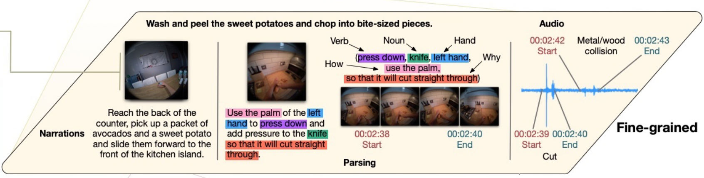
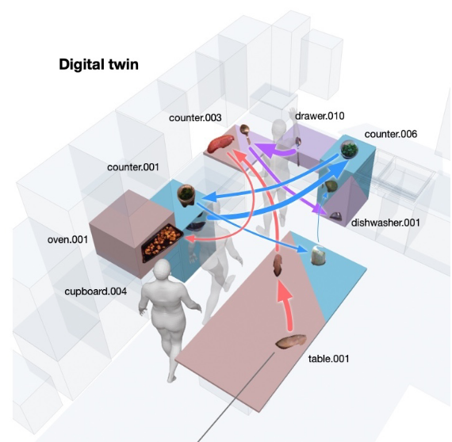
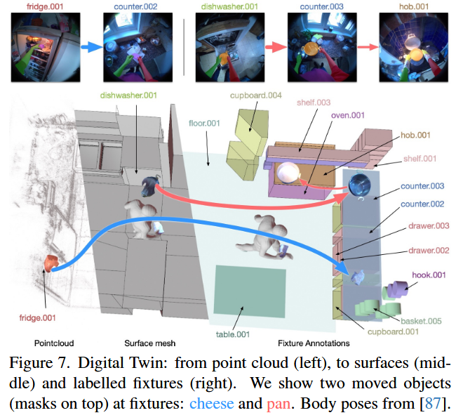
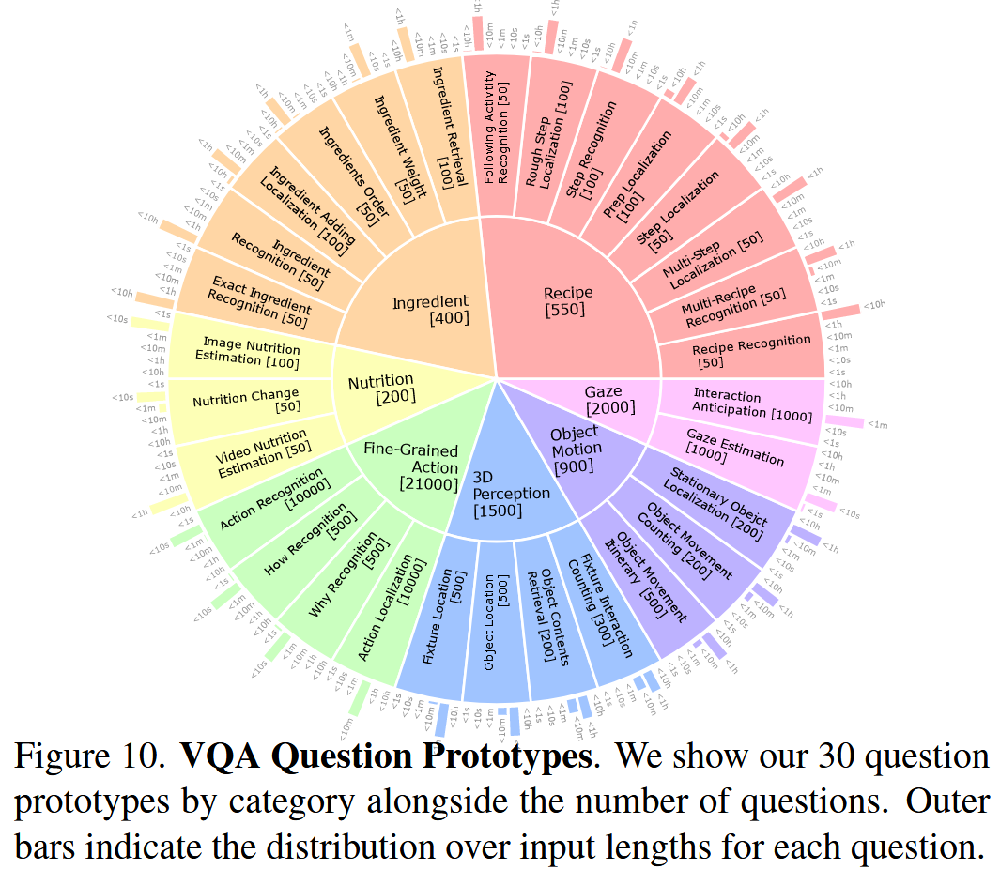

# HD-EPIC A Highly-Detailed Egocentric Video Dataset

## 0.introduction

### **0.1.贡献**

- 发布HD-EPIC：真实家庭场景的厨房第一视角视频数据集。
- 提供极其细致且相互关联的标注：菜谱步骤、细粒度动作、食材及营养、物体移动、音频事件与注视方向。
- 所有标注落到3D（数字孪生厨房、器具与物体位置），是“在野”数据中少见的实验室级细节。

### **0.2.论文工作**

- 构建 26K问答的VQA基准，考察菜谱/食材/营养、细粒度动作、3D感知、物体运动与注视等能力。
- 强大的长上下文模型 Gemini Pro 在该基准仅 37.6%，显示任务难度高、现有视频语言模型存在不足。
- 还评测了动作识别、声音识别、长时段视频-物体分割等任务。

### **0.3.数据规模**

- 41小时视频，9个厨房，413个厨房构件的数字孪生。
- 69道菜、59K细粒度动作、51K音频事件、20K物体移动、37K三维物体掩膜。
- 标注密度：平均每分钟263条。

HD-EPIC 把真实家庭做饭过程以高密度、多模态、3D对齐的方式系统标注，并用严格基准显示出当前模型在“时空+语义理解”上的明显差距。

**在野**：更贴近真实应用，更能检验模型泛化与鲁棒性，但训练/标注更困难、噪声更大。

## 0.图例解释

本文给视频做了跨时间、跨模态、对齐到三维世界的一整套标注：菜谱步骤、动作细节、食材与营养、声音事件、物体移动、手/物体分割，以及人的注视（gaze）。

所有标注都能落到一个三维数字孪生厨房里（台面、抽屉、烤箱、洗碗机、餐桌等都有编号），从而把“发生了什么、谁在动、在哪里”连接起来。

### 0.1.左侧：时间轴

表示多天录制

### 0.2.Centre-Top：菜谱与营养

#### 0.2.1.左侧：菜谱步骤（Step1-3）

- Step 1: Preheat the oven to 400F
	只是一条简短的准备动作（预热烤箱）。在右侧对应的是很短的一段时间条，表示它在时间轴上占用很少。
- Step 2: Wash and peel the sweet potatoes… add olive oil, cumin, chili powder… roast 10 mins
	这是最复杂的一步，因此被拆解成多行时间条，每一行代表这一步中的一个子活动序列（如“洗红薯”“取碗”“称重”“加入配料”等），并配上具体文字标签。
- Step 3: Pulse all the dressing ingredients in a food processor
	这一步同样有对应的时间条，但相对简单。

#### 0.2.2.中部：细粒度时间条（彩色小块）

- 每一行是某个子流程的时间线，彩色小块表示细粒度动作片段的起止与时长，空白表示停顿或切换。
- 不同行彼此上下对齐，表示这些子流程在时间上先后或并行的关系。
- 文字标签说明每行具体在做什么，例如：
	- Pick up sweet potato（拿起红薯）
	- Wash sweet potato（清洗红薯）
	- Put sweet potatoes in bowl and add oil…（把红薯放入碗中并加入油/调料）
- 顶部两条蓝色标题“Prep and Step”“Weigh and Add”是更高一层的子阶段名，表示这一堆彩色小块都属于“准备并执行步骤”或“称重并添加”这两个更抽象的阶段。

#### 0.2.3.营养信息

- 右边两张小图：一张是食材在电子秤上称重，另一张是加入调料后的状态。
- 旁边的文字列出该食材（如红薯）在当前处理量下的营养统计：Weight: 187g、Calories: 206g等。
- 不仅标了“做了什么、什么时候做”，还把称重过程与营养学数据挂钩，使模型/研究者能把具体摄入量与实际操作精确对应。

#### 0.2.4.总结

- 层级化对齐：从“菜谱步骤（高层）”到“子阶段（中层）”再到“细粒度动作（低层）”，都被映射到同一时间轴。
- 可度量的操作：通过彩色小块展示动作的起止与时长，可用于训练/评测动作分割、时序理解。
- 营养闭环：把称重—加料与营养数值联通，支持“做饭过程—摄入营养”的因果关联分析。
- 真实流程的还原：多行时间条显示这一步内并行/交错的小动作（如一边取碗、一边清洗/称重），更接近家庭真实操作而非脚本化演示。

### 0.3.中部（Centre-Middle）：细粒度叙述与解析

#### 0.3.1.左侧：Narrations（口述解说）

- 画面下方的句子是参与者在做菜时的自然口述，比如“Reach the back of the counter… pick up… slide them forward…”。
- 这类口述都有时间戳，与对应的视频片段同步，作为后续语义解析与动作标注的原始文本依据。

#### 0.3.2.中间：Parsing（语义解析 + 时序对齐）

- 标题句 “Wash and peel the sweet potatoes and chop into bite-sized pieces.” 表示当前大步骤。
- 彩色高亮把一句关键指令拆成语义角色并对齐到词/短语，如：Verb（press down）、Noun（knife）、Hand（执行体/施事的一部分：left hand）、How（方式：use the palm）、Why（目的：so that it will cut straight through）。
- 下方的四帧小图表示这一动作在视频中的关键帧，并给出起止时间：00:02:38 Start → 00:02:40 End
- 一句自然语言被结构化成“谁（手）—对什么（刀）—做什么（按压）—怎么做（用手掌）—为什么（为了直切）”，并与视频的具体时段绑定。

#### 0.3.3.右侧：Audio（音频事件）

- 蓝色为该时间段的音频波形，旁边打点标注事件及时间：
	00:02:39 Start / 00:02:40 End：Cut（切割声）、
	00:02:42 Start / 00:02:43 End：Metal/wood collision（金属/木头碰撞声）。
- 这说明音频也被做了事件级、带起止时间的标注，并与视觉/文本同步。

#### 0.3.4.总结

- 同一段烹饪操作，系统同时提供：
	自然口述 → 语义角色解析 → 视频起止帧 → 音频事件 的多模态、细粒度、时序对齐标注。
- 这种标注可支持模型学习：动作解析（谁对什么做了什么）、因果/意图理解（为何这么做）、音画对齐（听到的与看到的是否一致），以及更精细的时序定位与多模态推理。

### 0.4.中下（Centre-Bottom）：物体移动

#### 0.4.1.看图分区

1. 上排（Sweet potato）：跟踪“红薯”的一段流程。每张小图里都有手部掩膜（常见为红/绿，示意左右手）、以及目标物体的边界框/掩膜（此处红色框常用于红薯）。连续帧之间用箭头连接，表示拿起→放置→转移→入烤箱等动作的方向与顺序。
2. 下排（Food processor）：并行展示“食物处理机（料理机杯体）”的轨迹（蓝色框）。可见其经历取出→加入食材→装回/放置等阶段，说明不同物体的状态变化与位移路径都被记录。
3. 右上（Spoon）：在完成红薯相关操作后，又出现勺子的短流程（紫色框），如取出→使用→放入洗碗机。

#### 0.4.2.时间轴与事件点

- 中间的水平时间轴标了示例时间（如 20:10、20:30、20:50）。
- 轴上的彩色圆点是关键交互事件（如“被手拿起”“放到台面/烤箱”“放入洗碗机”等）。
- 从圆点往上/下连的细线，把事件与对应的小图帧一一对齐，表明这一刻发生了哪个物体的哪种交互。
- 不同物体的事件用不同颜色/轨迹区分，体现多物体并发：例如红薯的轨迹与料理机的轨迹在 20:30 前后重叠，说明现实操作里经常交替/并行进行。

#### 0.4.3.标注要素与含义

- 手—物体—动作三者同时出现：手部掩膜定位了操作者哪只手在与物体交互、物体边界框/掩膜提供像素级定位/实例级追踪、帧序列和时间轴记录时序关系（起止、先后、并行）。

- 空间/器具语义隐含在帧里（烤箱、台面、洗碗机等），后续会与右侧“数字孪生”中的3D厨房对齐，从而得到物体与固定设施的空间关系（如“把勺子放入洗碗机抽屉”）。

#### 0.4.4.支持的任务

- 长时段视频-物体分割/跟踪（对象持续可见且跨场景移动）。

- 手—物体交互识别（pick/place/pour/open/close 等）。

- 时序推理（多物体并行流程的依赖关系与因果顺序）。

- 与数字孪生结合后做3D位姿/落点统计与操作路径分析。

#### 0.4.5.总结

该图把“红薯、料理机、勺子”等多个对象在几十分钟内的被拿起—移动—放置全过程串起来，用掩膜/框+时间轴+事件点实现精细、可计算的移动与交互标注，真实反映厨房场景里多线程式的人—物操作。

### 0.5.右上（Right-Top）：三维数字孪生

#### 0.5.1.三维厨房“构件”带编号

- 场景里的固定设施都被建模并命名/编号：
	counter.001/003/006（不同台面）、drawer.010（抽屉）、dishwasher.001（洗碗机）、oven.001（烤箱）、cupboard.004（橱柜）、table.001（餐桌）等。

- 这些编号在数据集中是可引用的实体ID，方便把“某次放置/拿取”精确地指向哪一个台面或抽屉。

#### 0.5.2.物体与人物在3D里的运动轨迹

- 图中彩色箭头/曲线表示不同对象的移动路径与方向：红色粗箭头：某食材从台面/table.001 向前移动；蓝色/紫色曲线：勺子、碗、红薯等在 counter ↔ drawer/洗碗机/烤箱 之间的转移。

- 这些轨迹来自视频里对物体实例（带ID）的跟踪，随后通过相机位姿/标定映射到3D。

#### 0.5.3.视频 → 3D 的“空间对齐”

- 模型不只知道“拿起了勺子”，还知道在哪儿拿的、随后放到了哪个构件上：
	例：spoon picked at counter.006 → placed into drawer.010。

- 把时序事件（pick、place、open、close）与空间位置（哪个台面/抽屉/电器）一一对应，形成时间—空间—对象的闭环表示。

#### 0.5.4.更强的任务

- 空间问答/检索：”最后勺子被放到哪里？“ ”红薯从哪个台面进了烤箱？“
- 意图与规划：结合 gaze（注视）和路径，推断“下一步可能去哪个构件”。
- 可解释评测：错误不再停留在像素级，而是能定位到“把盘子错放到了 counter.003 而不是 counter.001”。

#### 0.5.5.数字孪生的作用

- 提供统一的三维参照系，让多段视频、多个传感模态（视觉/音频/文本/注视）在同一空间语义下融合。

- 相比纯2D框/掩膜，只看“画面像素”，数字孪生让模型具备可度量的空间理解与可落地的执行语义（实际在哪个台面/抽屉进行操作）。

**总结**： HD-EPIC 不只是“看视频并打标签”，而是把烹饪过程中的人和物落到可查询、可推理的3D厨房地图里，使“做了什么、在哪里做、往哪儿移动”的关系清晰可计算。

### 0.6.右下（Right-Bottom）：注视启动

#### 0.6.1.图中元素

- 左图：操作前，目光落在台面上的目标（例如红薯/工具）。
- 右图：操作后或准备放置时，目光落在将要放置的位置。
- 绿色小圆点：视线落点
- 两个红色线框金字塔表示两次视线投射锥体，指示“从眼睛/相机出发”的注视方向。
- 绿色射线连到被注视的目标物（台面上的物体或放置点）。
- 黑色双向箭头表示操作将要发生的位移（如从 A 处拿起→移动→在 B 处放下）。

#### 0.6.2.标注记录

- 时间戳：在“拿/放”事件之前的若干帧，记录“视线是否已落在对应物体/位置上”。
- 对象/位置ID：注视点与3D数字孪生中的具体构件/物体实例对齐（如 table.001、counter.006、spoon 实例等）。
- 事件类型：把注视与后续的 pick/place 等动作关联，形成“先看→后操作”的链条。

#### 0.6.3.作用

- 意图预测：模型可根据“注视序列”提前推测下一步要拿什么或放到哪里。
- 时序因果：验证“注视→动作”的先后关系，研究注意力在任务执行中的作用。
- 多模态对齐：与手—物体交互、物体轨迹、语音/文本一起，形成更完整的时空—语义监督。

## 1.Introduction

### 1.1.动机与挑战

让模型像人一样理解视频（从细粒度动作到长时活动）仍然很难；第一视角视频尤其难，因为相机剧烈运动、动作细微、操作时频繁遮挡且目标常出画，还要把头部运动、手部交互与整体场景动态“解缠”。

### 1.2.现有数据集缺陷

近年的ego数据集标注稀疏，不利于长视频跨段关联与3D落地。而标注密集的数据集多为合成或受控环境，真实感不足。

合成：用电脑生成（synthetic），在仿真/渲染引擎里，摄像机、物体、人体骨骼的状态全是已知的，导出像素级分割、3D位姿、深度、光流、接触事件等零成本，所以能做到“密集标注”。

受控环境：在实验室里用多机位、动捕、标志点、固定灯光/背景拍摄，也能较准确、全面地采集“密集标签”。

### 1.3.HD-EPIC创新点

新采集一批未被既有模型见过的在野、无脚本厨房活动视频，并做极其密集且互相关联的标注：食谱与步骤、原料称重与营养信息、动作的what/how/why密集叙述与时间边界、每个厨房的3D 数字孪生（台面、橱柜等构件）、物体移动的 2D/3D 轨迹与手/物体掩膜、凝视与物体交互的关联（拿取/放置前的“凝视预激”）。

### 1.4.测评设置

基于上述密集标注，构建一个覆盖食谱、原料/营养、细粒度动作、3D 感知、物体运动与凝视等多能力的26K 道多选 VQA基准，并在动作识别、声音识别、长时目标分割上做验证（作为验证数据集来用）。

## 2.Related Work

### 2.1.近期趋势

随着基础模型兴起，大量视频基准出现，分别测物理常识、计数、时间推理以及长视频理解等能力维度。

### 2.2.Ego相关基准局限

- Ego4D-NLQ：面向物体情景记忆，规模19.2K个自然语言查询（问句）。
- 人工问答1.6K：覆盖相对位置、情景记忆、空间推理等，但基于HM3D/ScanNet的静态场景被动视角，不是真实交互视频。
- 自动生成QA（5K/7K）：由Ego4D旁白自动出题，效率高但受限于短旁白文本。
- 只做时间类问题：另有基准只评测排序、计数、因果、方向等纯时间推理，能力面较窄。

### 2.3.3D落地相关工作

- Ego4D：提供环境扫描与静态3D物体位置。
- SLAM设备基准：用带SLAM的设备构建3D物体跟踪评测。
- 室内数字孪生：包含办公室/客厅的数字孪生。
- Ego-Exo专家任务：收集自我视角+他视角的专家任务数据。

### 2.3.与本文差别

上述数据集各自只覆盖少量标注类型；而HD-EPIC在同一批无脚本家庭第一视角视频上，提供最全面的一揽子标注：密集旁白、手/物体分割、以及场景与物体的完整3D数字孪生，用于支持更广能力评测。

### 2.4.总结

已有基准要么问题来源受限/被动静态视角，要么只覆盖窄能力或少量标注类型；在 3D 方面也多是局部能力。HD-EPIC 的定位是把多模态、密集、3D 落地的标注整合到同一套真实无脚本的第一视角视频里，以便全面验证模型。

## 3.Data Collection

### 3.1.参与者与设备（硬件与采样率）

- 参与者投入：每位参与者需长期投入，约 50 小时（拍摄 + 叙述 + 填写菜谱/营养信息）。
- 设备：使用 Project Aria 眼镜（多传感器）：3 个前向相机（1 个 RGB + 2 个 SLAM）、7 个麦克风、朝内相机用于凝视估计；视频 30 FPS、分辨率 1408×1408，眼动 60 FPS，SLAM 30 FPS；另配电子秤做营养称重记录。

### 3.2.拍摄指令与原始数据规模（在野、多日、整厨房活动）

- 拍摄规则：连续≥3天，进入厨房就开拍、离开就停止；共9名参与者，每人日均3.5–7.2小时（均值4.6小时）。
- 规模：共156段视频，单段平均15.9±14.5分钟，合计41.3小时（约 446 万帧）。

### 3.3.菜谱与营养记录（来源+修改+时间跨度+称重）

- 菜谱收集：拍完后，参与者提交实际做过的菜谱，注明来源（网站等）与改动；总计69道菜，平均6.6步、8.1种原料，从准备到上桌平均跨2.1段视频、耗时4小时48分；最长一份菜谱跨越2天6小时。
- 营养追踪：用MyFitnessPal手工记录称重与营养，累计558种食材；作者举例既有高热量（如Lazy Cake 4.8k kcal），也有低热量（如Crispy Cucumber Salad 274 kcal）的菜式分布。
- 这些信息后续用于 “称重—添加—营养随时间变化” 的跨模态标注与问答构建。

### 3.4.旁白与后处理（更密集的语义、3D 对齐与匿名化）

- 参照以往做法，参与者回看自己的视频，用Web工具进行口述叙事；本数据集扩展为不仅要说“做了什么（what）”，还要说“怎么做（how）/为什么（why）”，因此单位时间文字量比 Ego4D 更密集（约 3.8×）。
- 多视频SLAM与凝视：使用Aria MPS将同一厨房多天记录拼成单个点云，提取1kHz六自由度相机轨迹与眼动方向；将原始VRS转为 mp4，并移除面向眼部的相机画面以保证匿名。

## 4.Annotation Pipeline

### 4.1.标注食谱步骤和配料

不只标“关键镜头”，而是把做菜过程中的准备(prep)与执行(step)成对标注，覆盖抓取食材、取刀板、清洗等“准备动作”。这样能把真实厨房里的跨段插入、交错执行都描述清楚。

- Prep–Step 成对标注： 例如 Step“切番茄”的 prep 会包括“从存储处取番茄→清洗→取刀和砧板”；若 Step 是“加入切好的洋葱并搅拌”，那“切洋葱”本身就属于这个 Step 的 prep（强调上下文依赖与细粒度）。

- 覆盖度与时长统计： 近乎所有步骤（93.1%）都有对应的 prep；平均 prep 约 54.5 秒、step 约 78.2 秒（大方差反映真实生活节奏）。
- 营养相关时间段： 额外标注“称重(weighing)”与“添加(adding)”时间段，能动态计算菜品营养随配料加入的时间演化（例如展示到“香蕉巧克力曲奇”里各成分何时加入/称重，从而得到任意时刻的总营养）。

### 4.2.细粒度动作

让“叙述→可训练标签”的通道完整可用，并保留“怎么做/为什么这样做”的语义。

- 转写与校对：自动转写参与者的旁白/口述，再人工校对，得到高密度动作描述。
- 边界标注：为每条叙述精确标起止时间，最终得到 59,454 个动作片段，平均 2.0 秒/段（±3.4s）。
- 解析与结构化：从开放词表叙述中解析动词/名词/手部信息，并抽取“怎么做(How) / 为什么(Why)”从句（举例：左手推动盐罐顺时针转到位），累计 How 16,004 条、Why 11,540 条，便于转化为封闭词表任务（如动作识别）。
- 长尾统计与音频事件： 动作/物体分布长尾（见动/名词簇分布图），另标注 44 类、共 50,968 条声音事件（自来水声、碰撞声等）的起止与类别，补全视听多模态维度。

### 4.3.3D 数字孪生与物体运动

把每个厨房重建成可查询的3D 数字孪生（台面、橱柜、抽屉、家电、挂钩/置物架等都具名标注），并把视频里的动作、视线与物体轨迹对齐到 3D。

#### 4.3.1.场景

- 为每个厨房重建数字孪生：基于多视频 SLAM 的点云，在 Blender 里把台面/橱柜/抽屉/挂钩等储物位以及大型电器逐一建模并命名；不同于“已知环境的复制品”，这是从在野视频逆向构建的数字孪生。
- 规模与构成：每个厨房平均有 45.9 个带标签的 fixtures（最少 31、最多 62），其中台面/表面 14.2、橱柜 12.2、抽屉 7.8、电器 5.2。这些统称为 Fixtures F。
- 把叙述动作对齐到具体设施：检索叙述中指向设施的动作（如 open drawer），在数字孪生里锁定该实例并更新其状态；依据“人会在交互前 ≤1s 先注视”的研究，在动作前 1 秒内，取累计凝视交点最高的 fixture 作为目标设施。

#### 4.3.2.Hand Masks

- 手部掩码：每段视频抽帧覆盖不同动作和厨房位置，先自动分割、再人工校正部分样本；总计 770 万手部掩码（右手 390 万、左手 380 万），其中 1.1 万为人工金标帧。

#### 4.3.3.Moving Objects in 2D

- 定义“移动时段”：每当物体被移动到“放置”算一个时段，并在运动起点与终点各标一个 2D 框（即便是轻微挪动/推动也算）。
- 规模与统计：共 1.99 万条物体运动轨迹、3.69 万端点框；平均每分钟取走 9.2、放置 9.0 个物体；单条轨迹平均 9.0s，最长 461.5s。

#### 4.3.4.Object Masks

- 像素级掩码获取：在每个端点框基础上，用 SAM2 迭代分割并人工校正；74% 的掩码被校正；SAM2 与人工金标 IoU=0.82。

#### 4.3.5.Masks to 3D

- 掩码升维到 3D：结合稠密深度与 MPS 提供的 2D→3D 稀疏对应；在目标像素集合S上拟合线性系数α,β 以对齐估计深度与已有深度，并用 RANSAC 去噪，得到米制3D位置/体盒/轨迹。
- 米制：物体或点在三维空间里的坐标用米（meters）这种真实世界单位来表示，而不是“像素”“归一化单位”“任意缩放单位（unit）”或“只有相对尺度”的深度。能直接计算真实的距离、速度、体积。

#### 4.3.6.3D Object Motion

- 物体平均移动 61.4 cm (±84.5 cm)；27.6% ≤10 cm、7.6% ≥2 m，揭示“微小摆位”和“大范围迁移”并存。

#### 4.3.7.Object-Scene Interactions

- 物体与设施的空间关联：用几何启发式（如“必须落在台面的 x–y投影内”）把3D物体位置关联到最近的fixture，并人工逐条核验；平均每段视频中，物体会在1.8个不同设施之间移动。

#### 4.3.8.Priming Object Movement

- 凝视触发（Priming）定义：
	- Pick-up priming：拿起物体之前，凝视首先落在物体当前位置的时刻。
	- Put-down priming：放下物体之前，凝视首先落在物体未来位置的时刻。
- 计算规则与过滤：剔除离屏的取/放事件；若人在拿起前已“提前操控”物体（如手已接触很久），会剔除这类pick-up位置样本。
- 统计结果（可行样本）：起点priming平均提前3.99s (±2.94)，终点priming平均提前2.62s(±2.05)（详见图9表格）。

#### 4.3.9.Long Term Object Tracking

- 把多次“拿起→放下”等离散移动串起来形成长时程物体轨迹（object itineraries）；依托已抬升到米制的 3D 位置的高效流水线，可在几分钟内完成1小时视频的标注。

### 4.4.HD-EPICvs既有自我视角数据集

- 关键区别： 在“在野、长时段”的真实家庭厨房中，集中提供了此前分散在不同数据集中的多种高密度标签（菜谱/营养/细粒度动作/声音/注视/3D 场景与物体运动），且这些标签互相可对齐，从而成为多任务、跨时长尺度的验证基准。相比只标少量维度或在实验室/合成环境采集的数据，HD-EPIC 更贴近真实应用并支持更丰富的问题类型（也为后续 VQA 基准提供了素材）。

## 5.Benchmarks and Results

### 5.1.HD-EPIC VQA Benchmark and Analysis

#### 5.1.1.题型设计

本文采取标注流水线的密集输出，围绕七类标注构建了一个全面的VQA基准：

- Recipe：步骤/食谱的定位、检索与识别；
- Ingredient：食材集合、重量、添加时刻与顺序；
- Nutrition：配方营养随添加的变化；
- Fine-grained action：动作的“做了什么/如何做/为什么”，含时间定位；
- 3D perception：三维场景内相对位置理解；
- Object motion：长视频中对象的移动位置/时刻/次数；
- Gaze：对显著地标的注视与未来交互的预判。

#### 5.1.2.原型与采样策略

- 定义原型：本文为没类问题定义原型，并从注释中采样正确答案和强干扰项，整体为五选一。例如：
	- Object Movement Counting 问“某时刻看到的这个目标在整段视频中移动了多少次？”——依赖长视频与多跳推理；
	- Recognition让模型从候选文本中选出“动作是如何完成的”最佳描述，用于考察对细粒度操作方式的把握。
- 硬负例构造：在数据内采样“相似但不相同”的答案（如同一动作但不同“how”描述的 4 个候选），提升题目难度与真实性。
- 规模：30 个原型共生成 26,650 道多选题；基于现有原型与注释密度，上限可达 10 万 独特题目。输入长度横跨单帧到 7+ 小时。

#### 5.1.3.基线模型设置

- 语言仅输入：Llama 3.2 90B（强开源文本基线）；
- 视频-语言模型：VideoLLaMA 2（短上下文）、LongVA（最长开源上下文）、LLaVA-Video（含自我视角训练）、Gemini Pro（闭源、超长上下文）。

#### 5.1.4.结果与分析

- 整体难度高：语言盲测仅 26.5%/26.7%，仅略高于随机；开源视频-语言模型约 27.4%–32.4%；Gemini Pro 平均 37.6%，最佳但仍远低于人类样本基线 90.3%。

- 长度效应：各种时长均难，但≥1 分钟劣化最明显。

- 常见失败：
	- Recipe：步骤若使用相同物体/动作易混淆；
	- Ingredient：称重数值（人类可从秤读数）常被猜错，引发 Nutrition 题链式错误；
	- Fine-grained action：当答案共享相同名词时难区分“how”；
	- Gaze：倾向选择最近移动过的物体；
	- 3D/Object motion：左右方向与台面/抽屉等装置类型混淆。

### 5.2.Recognition Benchmarks

#### 5.2.1.动作识别

- **设置**：评测 5 个模型（SlowFast、Omnivore、MotionFormer-HR、VideoMAE-L、TIM），使用公开权重/或在 EPIC-KITCHENS-100 微调权重；提供**随机打乱标签**的机会水平作为下界。表 3 对比了在 EPIC-KITCHENS-100（含未见厨房子集）与**HD-EPIC**上的表现。

- 结果：在 HD-EPIC 上最佳仅 Verb 51% / Noun 37% / Action 24%（TIM A+V），显著低于 EPIC-KITCHENS-100 的 SOTA（77.1/67.2/57.5），显示场景/叙事粒度/时长带来的迁移挑战。

#### 5.2.2.声音识别

- 设置：评测 SSAST、ASF、TIM（A 或 A+V），均在 EPIC-Sounds 训练；在 HD-EPIC 上显著掉点。
- 结果：例如相对 EPIC-Sounds，SSAST −28.4，ASF −25.9，TIM −26.4；结论：音频对新环境/设备的鲁棒性不足。

### 5.3. Long-Term VOS Benchmark

#### 5.3.1基准构建与评测协议

- 使用第 4.3 节的像素级分割与轨迹关联构造 1000 段序列；每段含 1–5 个对象+2 只手。评测 Cutie、SAM2 与静态拷贝基线；指标为 J（IoU）、F（轮廓精度）与 J&F。

- 实现要点（补充细节）：由于帧量巨大，只向模型送记忆帧+评测帧；每个对象在首次出现帧写入工作记忆，其余帧作评测。
- 时长与复杂度（补充对比）：与 DAVIS17/YouTube-VOS19 相比，HD-EPIC 的序列平均 561s，且每序列对象数更多，显著加大时域挑战。

#### 5.3.2.结果与观察

- Cutie 与 SAM2 在手分割上表现更强，但在物体上受视角、光照与遮挡影响仍然明显；静态基线远落后。详见图 14 的 J/F/J&F 数值。

#### 5.3.3.总结原因

- 输入长、环节多、三维强约束：题目跨度从帧级到>7 小时，且要求跨“食谱-步骤-食材-营养-3D-运动-凝视”的跨模态/跨层级推理。
- 干扰项真实：同域硬负例使“靠外部知识/语言先验”很难投机。
- 现状差距清晰：最强闭源视频-语言模型平均 37.6%，与人类90.3%差距大；动作/声音识别从常见基准迁移到 HD-EPIC 明显掉点；长时段 VOS 在物体上仍难。

