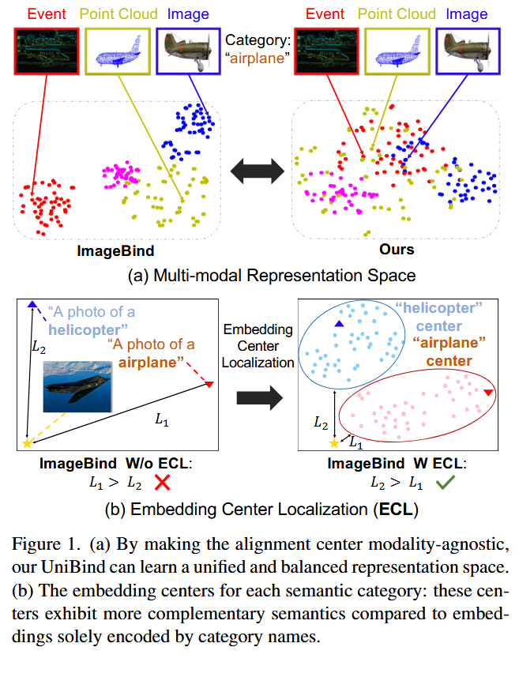
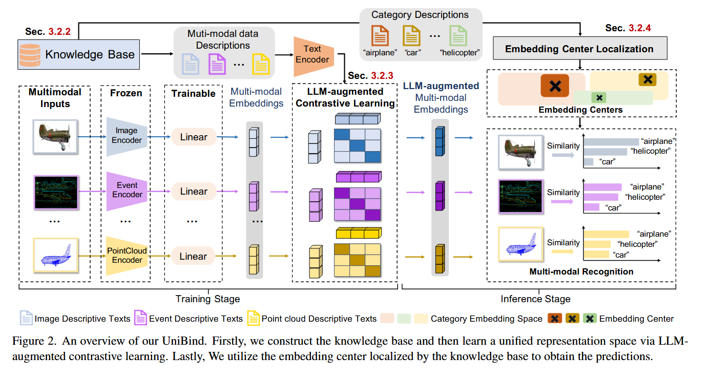
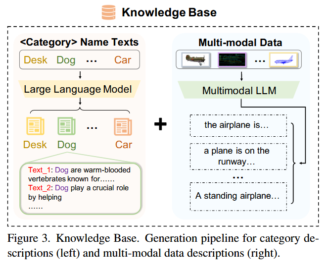
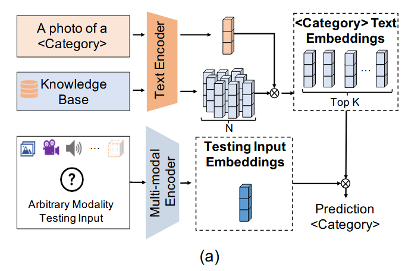
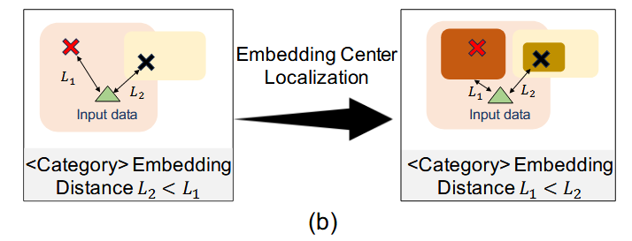

# Lyu_UniBind_LLM-Augmented_Unified_and_Balanced_Representation_Space_to_Bind_Them_CVPR_2024_paper

ImageBind：将图像作为中心模态，构建一个以图像为中心的表示空间。但这样做可能导致表示空间对所有模态来说是不平衡的，从而使这个空间不是最优的（sub-optimal）。

CLIP-style models：多模态对齐模型，“看图说话”和“读字想图”。

## 1.Introduction

### 1.1论文工作

1. 通过大语言模型（GPT-4、LLaMa，生成类别描述）和多模态大语言（BLIP-2、Adapter，生成多模态数据描述）构建了文本知识库。
2. 基于知识库和已编码的视觉嵌入适应性地构建了增强大语言模型的按类别分类的嵌入中心。
3. 通过对比学习将嵌入向量与增强LLM嵌入中心对齐，以此达到一种统一、平衡的表征空间。

### 1.2现有问题

1. 把特定的视觉模态作为对齐中心所产生的不平衡的表征空间。
	Q：为什么会产生不平衡的表征空间？
	A：视觉模态在数据量、质量或特征维度上占优，导致模型在训练中更依赖视觉信息，进而其他模态的特征被压缩或忽略，所以不平衡。例如语音数据量较少，训练结果就不好。
2. 对齐中心仅仅依赖类别名称的不可靠性。
	Q：为什么会不可靠？
	A：歧义（bank银行、河岸）、信息缺乏(apple苹果or苹果公司？)、文化差异、多义词同义词、上下文依赖。

### 1.3解决方法

**（a）多模态表示空间Multi-modal Representation Space**

- 左边：不同模态的数据（Event、Point Cloud、Image）虽然在语义上属于同一类（如 airplane），但在嵌入空间中分布得比较分散，不同模态的点聚成自己的小团，没能很好融合。
- 右边：通过使对齐中心（alignment center）与模态无关（modality-agnostic），不同模态的同类数据在空间中更紧密地聚到一起，形成一个统一且平衡的表示空间。提升了跨模态的语义一致性。

**（b）嵌入中心定位Embedding Center Localization**

- 左边
	- “helicopter” 和 “airplane” 这两个类别的嵌入中心是直接由类别名称生成的文本向量。
	- L₂（类别中心到真实样本的距离）大于 L₁（不同类别中心之间的距离），意味着同一类的数据离中心很远，中心代表性差。
- 右边
	- ECL 方法会根据数据分布来调整类别中心的位置，让它更贴近该类所有模态的数据。
	- L₂ < L₁（同类数据更接近中心，不同类的中心分离度更高）。
	- 这样得到的中心不仅由类别名编码，还融合了多模态特征，语义表达更完整。

**（c）核心改进点总结**

- 模态无关的对齐中心 → 不同模态的同类数据能聚到一起，统一表示空间更平衡。
- ECL（Embedding Center Localization）→ 类别中心不是死板地用类别名生成，而是根据多模态数据的实际分布进行优化，使中心更具代表性、可分性。

### 1.4论文结果

1. 在零样本识别上相较于之前的方法平均提升了6.36%。
2. 在ImageNet的多模态微调设置提升了6.75%的同时减少了90%的可学习参数。

**为什么要使对齐中心模态不可知？**

## 2.相关工作

### 2.1多模态学习

从模态对齐的角度，现有的方法可以分为两类：在token和特征层面的对齐。

1. token对齐方法将多模态token嵌入对齐到共享的token嵌入空间中，并设计后续编码器来提取这些输入token嵌入的特征。
2. 特征对齐方法基于统一的视觉语言表征空间，由CLIP风格的大视觉语言模型（BLIP）构建。

这些方法将一种或多种模态调整到图片表征空间来对齐多种可视模态。

1. ImageBind通过利用多种类型的图像配对数据来学习单一的共享表示空间，其利用了图像的绑定特性，并将每种模态的嵌入对齐到图像嵌入。

2. PointCLIP和AudioCLIP分别把点云和音频模态通过交叉模态相关性或注意力机制向图像特征对齐。

由于这些方法都把图像模态作为多模态对齐中心，因此得到的特征空间在视觉模态之间是不平衡的。

**UniBind**提出了一种学习模态无关的对齐中心的方法，产生一个统一的、平衡的视觉表征空间。将具有相同语义的多模态进行绑定，以弥补多模态之间的差距。

### 2.2LLMs和知识库

NLP中，知识库被用于增强对人类语言的理解和生成结果的鲁棒性。

利用大语言模型构建知识库的方法有两种：

1. 通过LLMs设计有效的文本提示，从而增强文本编码器的表征能力。
2. 使用LLMs，通过生成相似语义的文本来将文本输入的语义口语化（即转换为自然语言），旨在增强文本表示的鲁棒性。

**UniBind**使用LLMs和多模态LLMs来构建知识库，通过生成类别名称的描述，来融合每个类别的先验知识。增加了类别名称在表示空间中的文本嵌入。

### 2.3语言增强的表征学习

- 旨在通过融入语言，即文本数据，来增强视觉表征空间。

- 语言有助于识别概念上相似的图像对，即使其在视觉识别任务上不相似。

- 利用文本作为，在信息检索中对比学习的表征中心。

- UniVL-DR通过将图像口语化为文本，来解决模态鸿沟，并为多模态密集检索构建了统一的表征空间，从而获得显著的性能增益。

**Unibind**将文本嵌入中心策略引入到多模态领域，使用提取的文本嵌入作为对齐中心，并进一步绑定视觉模态嵌入。从而有利于多模态表示学习，获得均衡统一的表示空间。

### 2.4总结

1. CLIP2Video、PointCLIP：提升多模态数据的全面性和准确率，最终提升其在各种任务中的性能。
2. ImageBind通过利用多种类型的图像配对数据，设置了一种新的方式去学习一个单独的共享特征空间。其使用了图片的绑定性质，将其他模态的嵌入与图像嵌入对齐。

## 3.UniBind

### 3.1问题提出和Overview

**（1）问题提出**

1. 把图片当做中心模态来建立以图片为中心的特征空间会导致次优结果，可能会引入偏差，从而导致不同模态之间的表示空间不均。
2. CLIP类的模型单独利用从类别名称中得到的文本嵌入作为类别的嵌入中心，然而类别名称可能不能完全代表视觉数据的语义。

UniBind遵循了ImageBind推广的多模态识别设置，使用来自CLIP的默认文本提示模板集合P1~j~，P2~j~，..，Pn~j~，计算输入的多模态数据V~i~与C~j~类别的相似度得分：
$$
S_{(V_i, C_j)} = \cos \left< F^V(V_i), \text{mean}\{ F^T(P_j^1, \ldots, P_j^n) \} \right>
$$
Q：默认文本提示模板集合是什么？

A：模板通常是一些具有通用结构的句子，用于帮助模型理解和分类视觉内容。通常具有如下结构：“A photo/image/picture of a {类别}.”

Q：V~i~、C~j~、F^V^、F^T^分别代表的含义？

A：

- V~i~表示第i个输入数据样本，包括不同类型数据，如图像、文本、音频等。
- C~j~表示第j个类别或分类标签，在多模态识别任务中，模型会尝试将输入数据V~i~分类为某个类别C~j~，并计算它们之间的相似度分数，以判断V~i~最可能属于哪个类别。
- F^V^和F^T^代表视觉编码器和文本编码器，分别提取图像和文本嵌入。
- mean的含义为计算算术平均值。

**（2）Overview**

**1）整体思路**：用LLM吧不同模态的数据（图像/点云/事件）写为文本描述，再用文本编码器把这些描述映射到一个共享语义空间；同时把各模态的特征也投影到同一个空间，通过对比学习对齐。推理时，不直接和具体文本逐一对比，而是在该空间定位每个类别的中心点，任何模态的输入都与中心点计算相似度进行识别。

**2）训练阶段**：结合LLMs和多模态LLMs构建知识库，利用该知识库，通过LLM增强的对比学习来学习一个统一的表示空间。

1. 多模态输入&冻结的编码器
	- 三种输入举例：图像（蓝色）、事件相机数据（紫色）、点云（黄色）。
	- 各自经过预训练好的、被冻结的模态编码器（Image / Event / PointCloud Encoder）。
	- 目的：复用强表征，训练更稳定、成本更低。
2. 轻量可训练投影头（Trainable）
	- 冻结编码器输出后，接一个**线性层（Linear）\**作为投影头，把各模态特征映到\**同一个嵌入空间**（右边的竖条“Multi-modal Embeddings”）。
3. 来自知识库的“数据描述文本”（Knowledge Base → Multi-modal data Descriptions）
	- 由LLM生成/扩写提供每条数据对应的文本描述。
	- 这些描述统一输入文本编码器得到文本嵌入。
4. LLM增强的对比学习（Sec. 3.2.3）
	- 把同一样本的多模态特征与其文本描述特征拉近，与其他样本（或其他模态不对应的描述）拉远。
	- “LLM-增强”体现在：文本描述更丰富多样（同一对象可有多种说法/视角），因此能给每个样本提供多正样本的语言监督，缓解模态差异、提升语义对齐质量。
	- 训练后得到一组LLM-增强的多模态嵌入（LLM-augmented Multi-modal Embeddings）。

**3）推理阶段**：基于统一的多模态表示空间，通过一个新颖的嵌入中心定位模块来推断识别结果。

1. 类别描述与“类别嵌入空间”（Category Descriptions）
	- 知识库还提供类别层面的描述（如airplane、car、helicopter，包含多模版/多描述）。
	- 这些类别文本经文本编码器得到一批类别嵌入
2. 嵌入定位中心（Sec. 3.2.4）
	- 用上述多样的类别描述嵌入来定位/估计每个类别在共享空间里的中心（图中黑色“×”或绿色标记）。
3. 多模态识别（Multi-modal Recognition）
	- 对任意模态的测试样本：经过自己的冻结编码器+线性投影，得到输入的嵌入；与各类别中心计算相似度；相似度的最高的为预测结果。

### 3.2知识库构建

构建包括两大部分：

1. LLMs生成类别描述，用于定位嵌入中心。（仅依赖类别名称来对齐模态与提取的嵌入不可靠）
2. 多模态LLMs生成多模态数据描述，缓解多模态之间的模态鸿沟。

Q：多模态数据描述是什么？

A：例如，输入模态：图像，模型生成的描述：一只灰白相间的猫正躺在沙发上睡觉，图像->文字。

**1）左侧类别描述生成：**

1. 输入：类别名称文本，如Desk/Dog/Car
2. 处理：把这些类名输入LLM，围绕各类名自动生成多条、内容多样的自然语言描述（定义、属性、功能、上下文等）。
3. 输出：每个类别对应一捆描述文本（Desk一捆、Dog一捆、Car一捆）

这些描述文本被送入文本编码器得到文本嵌入，用于：训练时的语义监督、推理时的定位类别中心。

**2）右侧多模态数据描述生成：**

1. 输入：多模态样本（图像、时间数据、点云等）
2. 处理：MLLM做自动标注/生成多样化描述
3. 输出：每个样本的一组文本描述。训练时把样本的模态特征与这些对应描述的文本特征做对比学习（正样本拉近、负样本拉远），从而把不同模态统一到同一个语义空间里。

**3）中间的+**：合成统一知识库

**4）优点：**

1. 丰富多样的文本监督（缓解“单一 prompt”带来的偏差）。
2. 稳健的类别中心（由多描述聚合得到的类原型）。
3. 跨模态的一致语义坐标系（便于图像/事件/点云共同识别）。

**5）详细步骤：**

使用LLMs，如GPT-4和LLaMa来生成类别描述：
$$
T_{C_i}^1, \ldots, T_{C_i}^n = F^{LLMs}(C_i),
$$
其中T1~Ci~，…，Tn~Ci~是范畴C1的n个生成描述，F^LLMs^是前文提到的的LLMs。随后通过多模态LLMs对多模态数据进行描述：
$$
T_{I_i}, \ldots, T_{A_i} = F^{MLLMs}(I_i), \ldots, F^{MLLMs}(A_i)
$$
其中，I~i~，…，A~i~表示多模态数据输入，T~Ii~，…，T~Ai~表示生成的多模态数据描述，FLLMs表示上述多模态LLMs。

例如，考虑到类别[‘桌子’]，本文使用LLMs去生成类别描述，如[“一台电脑显示器醒目的放在桌子上，说明它是一个工作站”]。接着本文使用多模态LLMs去关于[‘桌子’]类别生成图像数据描述。最后编写这两组描述来形成本文的知识库。

### 3.3统一表示空间学习

本文在知识库的基础上扩展，将多个模态对齐，以学习一个统一的多模态表示空间。对于多模态数据，本文利用从现存的多模态模型（具有冻结参数和可学习的后续线性层）导出的特征编码器，来获得每个模态的嵌入：
$$
v_{I_i}, \ldots, v_{A_i} = F_I(I_i), \ldots, F_A(A_i)
$$

其中v~Ii~，…，v~Ai~是提取的嵌入，F~I~（·），…，F~A~（·）是每个模态的特征编码器。随后通过文本编码器生成多模态数据描述T~Ii~，…，T~Ai~的文本嵌入：
$$
z_{I_i}, \ldots, z_{A_i} = F^T(T_{I_i}), \ldots, F^T(T_{A_i})
$$
其中，T~Ii~，…，T~Ai~是生成的多模态数据描述，FT（·）为文本编码器，z~I~，…，z~A~是提取的文本嵌入。提取的视觉和文本嵌入用于学习一个统一的表示空间。

与现有的多模态学习框架（ImageBind）对比，本文不在视觉数据中以图像中心为基础施加对比学习目标，而是在多模态和文本嵌入之间施加对比学习目标。举例：为了将视觉模态I对齐到统一表示空间，提取的视觉嵌入v~I1~，…，v~In~和相应的z~I1~，…，z~In~被用于在这个表示空间里进行对比学习。

通过相应描述生成的文本嵌入被认为是输入视觉数据的阳性样本，而来自其他视觉数据的文本嵌入被用作负样本（InfoNCE的一个变体，对比学习的损失函数，用于衡量两个表示之间的相似性，并试图让相似的样本在特征空间中更接近，不相似的样本对更远离）：
$$
\mathcal{L}_{(\mathcal{I}, \mathcal{A})} = - \log \frac{\exp(v_{I_i}^T \cdot z_{I_i} / \tau)}{\exp(v_{I_i}^T \cdot z_{I_i} / \tau) + \sum_{j \neq i} \exp(v_{I_i}^T \cdot z_{I_j} / \tau)} \tag{6}
$$
其中，z~Ij~是视觉模态I中的视觉数据I~j~中对应的文本嵌入，τ为温度参数，用于控制分布的平滑程度。分子exp（）表示正样本对的相似性得分，分母包含正样本对的相似性得分和所有负样本对的相似性得分之和。

### 3.4嵌入中心定位

**（a）嵌入中心定位细节：**

1. 输入
	- 传统CLIP风格的类模板A photo of a <Category>。
2. 知识库
	- 为每个类别准备大量不同的自然语言描述。
	- 这些描述被送进text encoder得到N个文本嵌入向量。
3. 任意模态测试输入->多模态编码器
	- 任意模态的实际测试输入（图像 / 事件 / 点云 / 音频 等）通过相应的多模态编码器，产出一个测试嵌入向量（与文本嵌入处在同一共享空间）。
4. 预测
	- 测试向量与知识库中的各类别文本向量计算相似度。

**详细步骤：**

本文通过从知识库中为每个类别选择50个文本嵌入来定位嵌入中心，利用基本提示["A photo of a [Category]"]来计算余弦相似度，再根据最高的得分选择前50个描述。随后通过文本编码器F^T^，对这50个描述进行处理，得到类别C~i~的文本嵌入中心EC~i~：
$$
EC_i = \{z_{C_i}^1, ..., z_{C_i}^{50}\} = F^T(T_{C_i}^1), ..., F^T(T_{C_i}^{50})
$$
由前50个描述生成的文本嵌入共同构成每个类别的嵌入中心EC~i~，因此UniBind从知识库中提取的嵌入中心，比单纯使用类别吗具有更多的互补语义。并且本文的嵌入中心在表示空间中有更清晰的类别边界。

**（b）嵌入中心定位的影响：**

本文按照以下方法计算任意模态输入M~i~与类别C~j~之间的相似度：
$$
S_{(M_i, EC_j)} = \max \{ \cos \langle F_m(M_i), z_{C_i}^1, ..., z_{C_i}^{50} \rangle \},
$$
其中，z~I~，…，z~A~是类别C提取的文本嵌入。

- 优化前
	- 红X和黑X为不同类别的嵌入中心，L1和L2表示到输入数据嵌入点的距离，在这个例子中，L2小于L1，意味着数据更接近黑X。

- 优化后
	- 经过嵌入中心定位（即图a）后，L1小于L2，表示优化后输入数据更接近红X代表的类别。这种优化使得嵌入中心更加精准地反映输入数据的类别，从而提高分类准确性。

### 3.5实现

1. 骨干模型

	- CLIP、ImageBind、PointBind、E-CLIP、PointCLIP和AudioCLIP。

	- 本文对图像、点云、音频、热度、视频和事件数据使用单独的视觉编码器，在每个模态的视觉编码器的末端添加一个简单的线性层，用于将多模态嵌入映射到统一表示空间，并使用来自于骨干模型的冻结文本编码器作为文本编码器。

2. 训练和推断

	- 对于零样本识别任务，UniBind使用基本提示["A photo of a [Category]"]从知识库中选择了相关性最高的前50个文本嵌入作为类别嵌入中心。然后利用多模态嵌入和类嵌入中心之间的相似性进行识别预测。

	- 对于微调，表示学习空间学习的训练阶段的推断过程基本与零样本相同。

